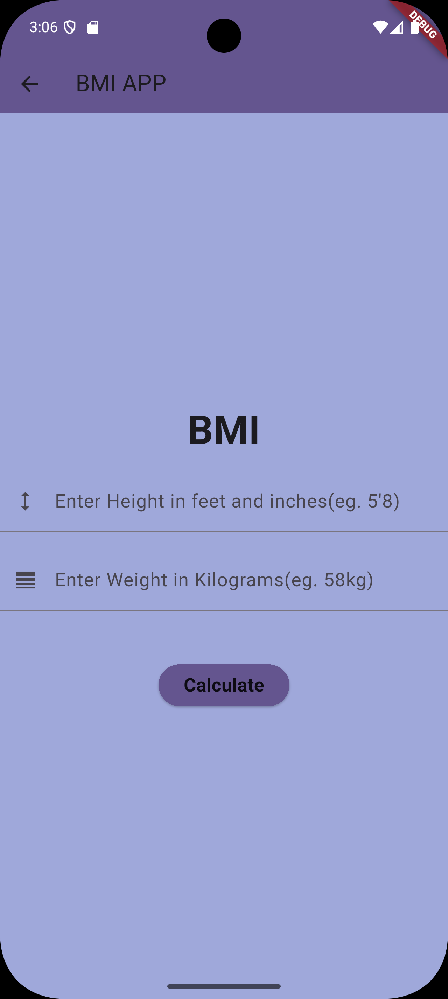

# 📱 BMI Calculator App

A modern, clean, and interactive Body Mass Index (BMI) calculator built with Flutter. This app helps users calculate their BMI based on height and weight, providing health feedback and categorization.

---

### 📸 App Screenshots

| **Input Screen** | **Result Screen1** | **Result Screen2** |
|:---:|:---:|:---:|
|  |  |  
| *Clean inputs for Height & Weight* | *Instant calculation & Health Tips* |


---

### 🛠️ Tech Stack


### ✨ Features
* **Real-time Calculation:** Instant updates as sliders move.
* **Health Feedback:** Categorizes results (Underweight, Normal, Overweight).

---

### 🚀 How to Run
1. Clone the repo:
   ```bash
   git clone [https://github.com/saadullah-001/BMI-Calculator-App.git](https://github.com/saadullah-001/BMI-Calculator-App.git)
